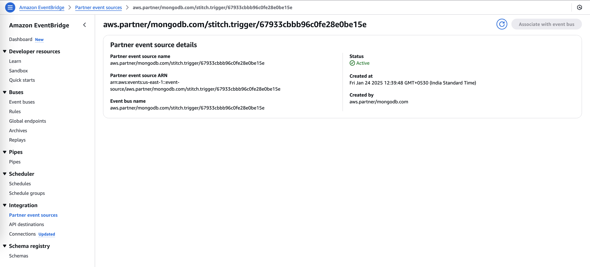
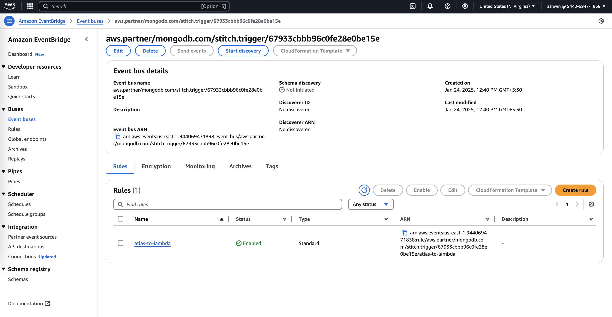

# MDB Trigger <> GraphQL Subscription

Create a MongoDB Trigger to listen for changes in the Jobs collection and use AWS EventBridge Partner Events and EventBus to trigger a lambda function to call the GraphQL Endpoint notifying the change.






This lambda function is used to trigger a Subscription whenever there is a change in the MongoDB Collection and update the GraphQL Endpoints in real time.

Create the lambda function `mongo-subscription` and set the below environment variables

```
API_KEY=
ENDPOINT=
REGION=
```

Now let's [Setup the AWS Sagemaker](../../5-aws-sagemaker/predictive-maintenance/)
