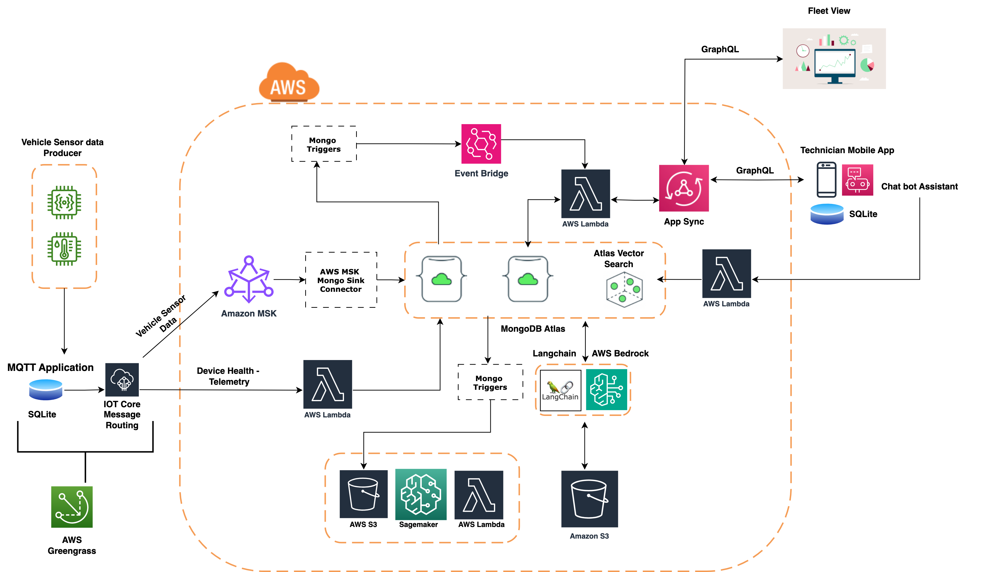

### Project Overview

This is a Cloud Infrastructure Automation Project for an IoT Greengrass Fleet Predictive Maintenance project. The project uses various combinations of tools such as AWS CDK, AWS SDK, AWS CLI, and ATLAS CLI to automate the infrastructure. The automation includes setting up the AWS environment and MongoDB, provisioning a MongoDB cluster, deploying and configuring AWS AppSync, setting up MongoDB triggers with AWS EventBridge, configuring MongoDB Private Endpoints, setting up MSK with the Mongo Connector, deploying the Fleet Predictive Maintenance Model, and configuring various Lambda functions. These functions include invoking a SageMaker model for pulling and pushing data to/from MongoDB, chat assistants, Lambdas for AppSync resolvers and subscriptions, and much more.

---

### Prerequisites

Before proceeding, ensure you have the following prerequisites installed:

- Install Node.js 20.x (or use nvm to switch versions - [NVM Installation Guide](https://github.com/nvm-sh/nvm))
- [Install Python3.13](https://www.python.org/downloads/)

---

## High level Architecture



## Setup Instructions

### Part 1. AWS Setup

[Setup AWS](./aws-setup/)

### Part 2. MongoDb Setup

[Setup Mongodb](./mongodb-setup/)

### Part 3. Infra Deployment

[Deploy Infrastructure](./infra/)

### Part 4. Edge Setup

[Setup Edge](./edge/)

### Part 5. Greengrass Telemetry Data Setup

[Setup Greengrass Telemetry](./greengrass-telemetry/)

### Part 6. Set up Field Technician's Mobile Application

With the previous steps done, vehicle telemetry would flow to MongoDB, then to AWS and finally be used to do predictive maintenance. If we determine a vehicle needs service, a vehicle maintenance job is created in MongoDB. These are shown in this mobile application.

Credentials to login to mobile application

e-mail   : technician@live.in
password : 123

[Set up Field Technician's Mobile Application](./mobile/)

### Part 6. Set up Fleet Dashboard

The Fleet dashboard shows all vehicle maintenance jobs, vehicle information, and parts inventory.

Credentials to login to mobile application

e-mail   : fleetadmin@live.in
password : 123

[Set up Fleet Dashboard](./web/README.md) holds the code for the web dashboard. This shows information about the fleet.

### Part 7. Test the Job Creation Floe

Go to AWS Iot Core -> MQTT Test Client and Produce the below sensor data message to the topic `test/topic`
```
{"vehicleId":"652ed1957fb496144946ae6e","timestamp":1734938650,"voltage":1.11,"current":3.111}

```


### Part 8: Destroy Architecture

Some resources need to be manually deleted, as they are not part of the CDK deployment and were created using the CLI/SDK based on CDK outputs. These include:

- **Atlas Private Endpoint & AWS VPC Endpoint**  
   - Go to Atlas > Network Access > Private Endpoints > Terminate the endpoint.
   - Go to AWS > VPC > Endpoints > Delete the newly created endpoint.

- **MSK Connector & Plugin**  
    - Go to AWS > MSK > Connectors > Delete `msk-mdb-connector`.
    - Go to AWS > MSK > Plugins > Delete `msk-mdb-connector-plugin`.

- **VPC Destination & IoT Rules**  
    - Go to AWS > IoT > Message Routing > Destinations > Delete the newly created destination.
    - Go to AWS > IoT > Message Routing > Rules > Delete `all_events_rule` and `logs_rule`.

- **SageMaker Notebook Instance and Lifecycle Configuration**  
    - Go to AWS > SageMaker AI > Notebook > Stop the `iot-greengrass-demo-notebook-instance`, and then delete it.
    - Go to AWS > SageMaker AI > Lifecycle Configuration > Notebook Instances > Delete `iot-greengrass-demo-lifecycle-config`.

- **Destroy the CDK Stack**  
    - Go to the `infra` folder and destroy the stack:
        ```bash
        cd ./infra
        cdk destroy --context orgId=your-mongodb-org-id
        ```


