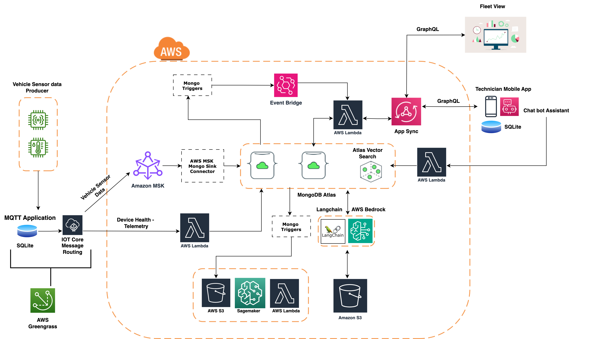

# AWS IoT Greengrass | AWS Sagemaker | AWS Bedrock | AWS MSK | MongoDB Atlas  | MongoDB Atlas Vector Search

## High level Architecture

## Setup Instructions

### Part 1. Set up Atlas Predictive Maintenance Backend

[Set up Atlas Predictive Maintenance Backend](./1-atlas/)

### Part 2. Set up Edge Gateway

[Set up Edge Gateway](./2-edge/)

### Part 3. Set up AWS Backend for Edge Gateway Greengrass Runtime Telemetry

[Set up AWS Backend for Edge Gateway Greengrass Runtime Telemetry](./3-aws-greengrass-telemetry/README.md)

### Part 4. Set up AWS Lambda Functions

[Set up AWS Lambda Functions](./4-aws-lambda/predictive-maintenance/README.md)

### Part 5. Set up AWS Backend for Predictive Maintenance

[Set up AWS Backend for Predictive Maintenance](./5-aws-sagemaker/predictive-maintenance/README.md)

### Part 6. Set up the Backend for the Chat Assistant

[Set up AWS Backend for the Chat Assistant](./6-aws-bedrock/README.md)

### Part 7. Set up Field Technician's Mobile Application

With the previous steps done, vehicle telemetry would flow to MongoDB, then to AWS and finally be used to do predictive maintenance. If we determine a vehicle needs service, a vehicle maintenance job is created in MongoDB. These are shown in this mobile application.

[Set up Field Technician's Mobile Application](./7-mobile/)

### Part 8. Set up Fleet Dashboard

The Fleet dashboard shows all vehicle maintenance jobs, vehicle information, and parts inventory.

[Set up Fleet Dashboard](./8-web/README.md) holds the code for the web dashboard. This shows information about the fleet.
