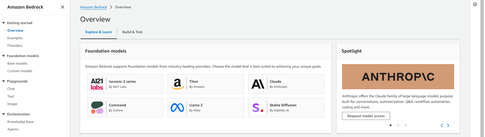
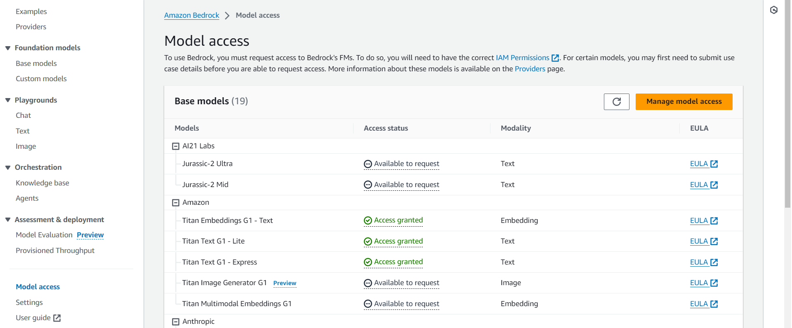
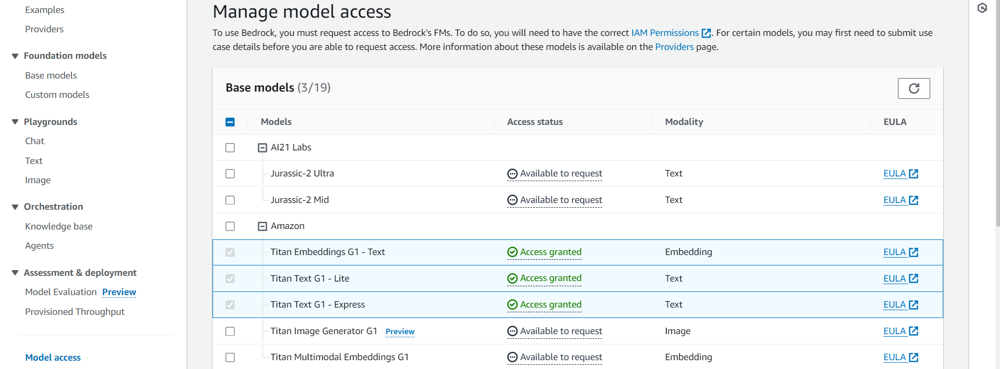
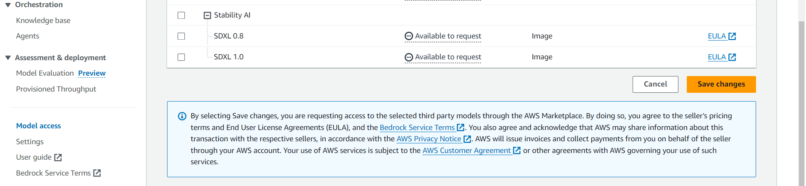

## AWS SETUP

### Prerequisites

Before proceeding, ensure you have the following prerequisites installed:

- [Install AWS CLI](https://docs.aws.amazon.com/cli/latest/userguide/getting-started-install.html)
- **Create an IAM user for AWS CLI**:
    - Create an IAM user with **Administrator permissions** (or similar elevated privileges) in your AWS account. This user should also have the specific policy below in addition to the required admin permissions:
    
    ```json
    {
        "Version": "2012-10-17",
        "Statement": [
            {
                "Effect": "Allow",
                "Action": "iam:PassRole",
                "Resource": "arn:aws:iam::944069471838:role/GreengrassIotSageMakerExecutionRole"
            }
        ]
    }
    ```

    - **Access Keys**: Generate Access Key and Secret Key for the user you created.
    
    - **Configure AWS CLI**: Run the following command to configure the AWS CLI with your **Account ID**, **Access Key**, **Secret Key**, and **Region**:
      ```bash
      aws configure
      ```

- [Install AWS CDK](https://docs.aws.amazon.com/cdk/v2/guide/getting-started.html)


## Cloudformation Configuration**:
    - Activate the below CloudFormation resources in the AWS region of your choice (https://docs.spot.io/tools-and-provisioning/cloudformation/activate-a-resource-in-public-extensions-registry)


        ```
        MongoDB::Atlas::Project    
        MongoDB::Atlas::Cluster
        MongoDB::Atlas::DatabaseUser
        MongoDB::Atlas::ProjectIpAccessList
        ```


# Amazon Bedrock

This solution uses two models provided by Bedrock, the Titan Embeddings G1 to generate embeddings and Titan Text G1 - Lite to answer questions.

## 1. Model Access

Before you can use the LLMs provided by Bedrock, you'll need to request access to them. 



To request access to the required two Titan models, open up Model Access from the side menu.



Then click on Manage model access. This will let you choose the models you want and request for access.



Now choose the Titan Embeddings G1 and Titan Text G1 - Lite models and click on Save changes.



Request to most models should be granted fairly quickly.
