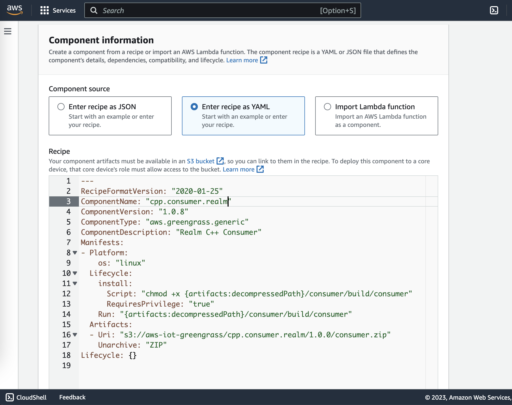
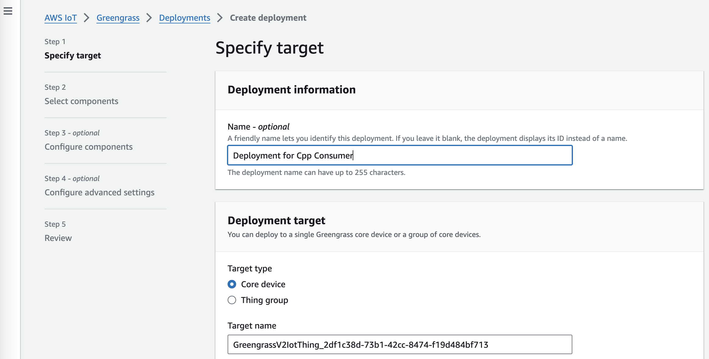

# C++ | MQTT | Consumer

## Prerequisites

* [CMake](https://cmake.org/download/) 
* MacOS / Ubuntu

## Overview

Here we are building the C++ application with MQTT consumer to consume the message from the MQTT transport and store it in the SQLite database which will be synced to MongoDB in real-time via Message Routing 


### Instructions

```
docker ps -a

docker cp ../../2-edge/cpp/consumer <iotgreengrass containerid>:/

docker exec -it <iotgreengrass containerid> /bin/bash

cd /consumer

mkdir build

cmake -B build -S . -DCMAKE_BUILD_TYPE="Debug" .

```


Sample output on successful completion


    ...........
    -- Performing Test HAVE-Wunused-but-set-variable
    -- Performing Test HAVE-Wunused-but-set-variable - Success
    -- Configuring done (60.7s)
    -- Generating done (0.1s)
    -- Build files have been written to: /consumer/build


```
cmake --build build --config Debug

```

Sample screenshot of the successful completion of the build


(Optional) To run the consumer in the local. Ensure you are in the consumer folder copied from the container.

```
build/consumer --endpoint <MQTT_ENDPOINT> --cert /greengrass/v2/thingCert.crt --key /greengrass/v2/privKey.key
```

MQTT_ENDPOINT will be found in AWS -> IoT Core -> MQTT test client -> Connection Details -> Endpoint


on a successful run, it will consume the data . Below is a sample output.

```

Connecting to the MQTT server...OK
Waiting for messages on topic: 'topic'
Starting
{"current":0.680375434309419,"timestamp":1709556676763,"vehicleId":"65e09427028c72731d009fae","voltage":6.521360975467302}
```


exit from the container

```
exit
```

copy the consumer repo from the container to the base directory

```
docker cp <iotgreengrass container>:/consumer ../../../
```


Steps to deploy the C++ Application to the Greengrass device container via [AWS Components](https://docs.aws.amazon.com/greengrass/v2/developerguide/create-components.html)

1. Ensure you are in the consumer folder copied from the container and Zip the build folder as consumer.zip
   ```
   cd ../../../consumer/
   zip -r consumer.zip ./
   ```
   
3. Create a S3 folder structure `s3://aws-iot-vehicle-telemetry/cpp.consumer.iot/1.0.0/` and Upload to AWS S3 Bucket using the console or [aws-cli](https://docs.aws.amazon.com/cli/latest/userguide/getting-started-install.html) using

   
   `aws s3 cp consumer.zip s3://aws-iot-vehicle-telemetry/cpp.consumer.iot/1.0.0/`
   
   
5. Ensure the role "GreengrassV2TokenExchangeRole" has appropriate permissions to read the files from the S3 bucket. 


In-line policy: GreengrassV2TokenExchangeRoleAccess

```
{
    "Version": "2012-10-17",
    "Statement": [
        {
            "Effect": "Allow",
            "Action": [
                "logs:CreateLogGroup",
                "logs:CreateLogStream",
                "logs:PutLogEvents",
                "logs:DescribeLogStreams",
                "s3:GetBucketLocation"
            ],
            "Resource": "*"
        }
    ]
}

```

Trust Relationship:
```
{
"Version": "2012-10-17",
"Statement": [
    {
        "Effect": "Allow",
        "Principal": {
            "Service": "credentials.iot.amazonaws.com"
        },
        "Action": "sts:AssumeRole"
    }
        ]
}
```


7. Create an AWS Greengrass Component using the console or aws-cli https://docs.aws.amazon.com/greengrass/v2/developerguide/create-components.html


4. Recipe example. Update the S3 bucket path.

```sh
---
RecipeFormatVersion: "2020-01-25"
ComponentName: "new.consumer.cpp"
ComponentVersion: "1.0.0"
ComponentType: "aws.greengrass.generic"
ComponentDescription: "IoT C++ Consumer"
Manifests:
- Platform:
    os: "linux"
  Lifecycle:
    install:
      Script: "chmod +x {artifacts:decompressedPath}/build/build/consumer"
      RequiresPrivilege: "true"
      Run: "{artifacts:decompressedPath}/build/build/consumer --endpoint axmft2e63giec-ats.iot.us-east-1.amazonaws.com\
        \ --cert /greengrass/v2/thingCert.crt --key /greengrass/v2/privKey.key"
  Artifacts:
  - Uri: "s3://aws-iot-vehicle-telemetry-anuj/new.consumer.cpp/1.0.0/build.zip"
    Unarchive: "ZIP"
Lifecycle: {}
```


5. Once the component is created, open the component and deploy it to a Greengrass device using the Deploy option and create a new deployment by entering the Greengrass core device. select the target type as core device and copy the core device name. Select ```cpp.consumer.iot``` in the My Components list. Select ```cpp.consumer.iot``` in the Selected components. Keep all other options as default.
 

6. Wait for a few minutes for the deployment to be completed. Now the producer can produce a message to the topic which will be consumed by this application deployed using the components. 


6. **Congratulations!!**, You have now completed the setup of producer and consumer. To validate the setup, you can now try one message through the producer in the vehicle container and check in the Atlas database for syncing.


## Troubleshooting


**Consumer**

```
docker exec -it <iotgreengrass container id> /bin/bash

cat /greengrass/v2/logs/greengrass.log

cat /greengrass/v2/logs/cpp.consumer.iot.log

cd /greengrass/v2/packages/artifacts-unarchived/cpp.consumer.iot/1.0.0

```

