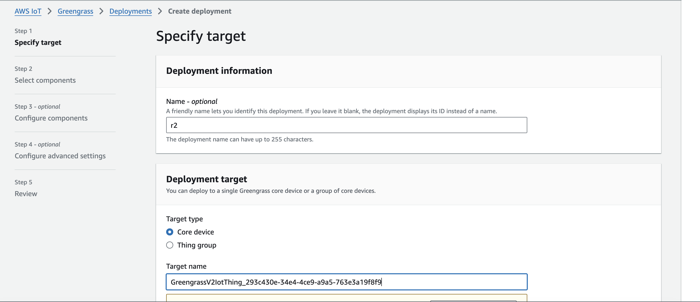
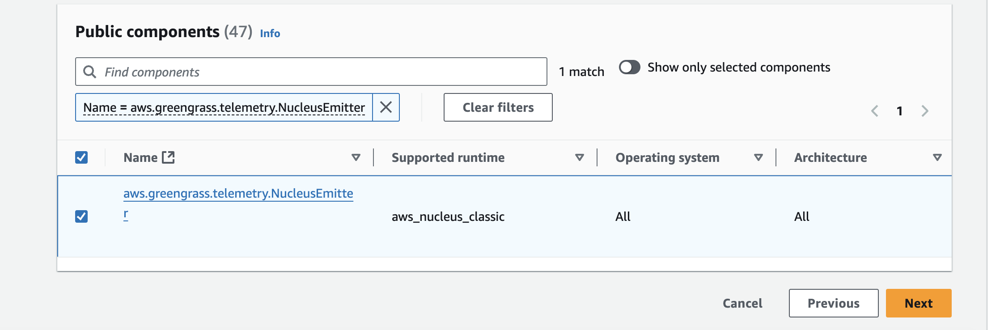
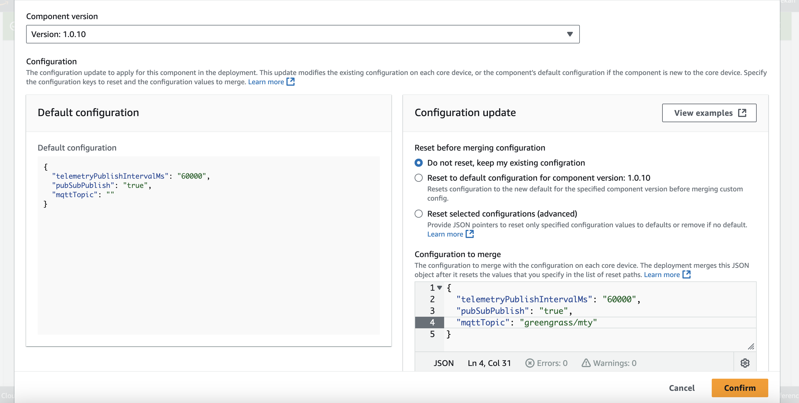
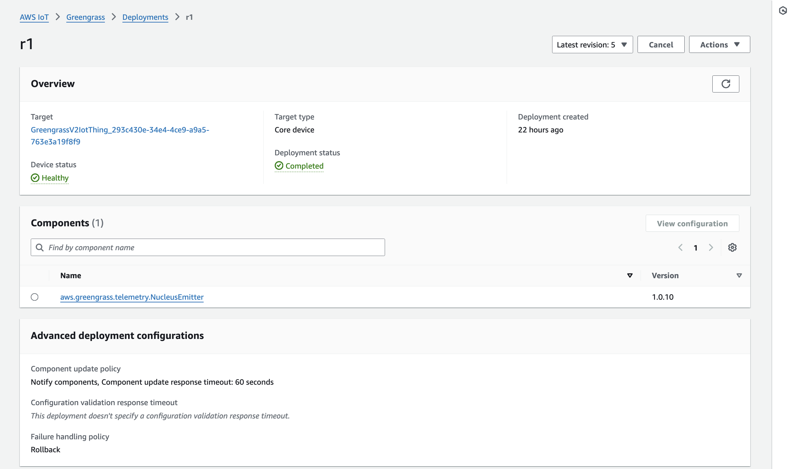

# Telemetry <> MongoDB

IoT Device health telemetry data helps you monitor the performance of critical operations on your Greengrass core devices. You can use these applications to gain insights into fleet health.

To set it up,

1. Deploying the Nucleus Telemetry emitter to send the telemetry data to the AWS Cloud Lambda function via Message Routing , Go to AWS > IOT > Greengrass > Deployments > Create New Deployment

- Here select the name of the core device that is deployed on edge

2. On next step, select nuclues emitter component , as shown in image: 

3. On next step , Edit the Configuration of the component , only one paramter will change that is mqttTopic and that is 'greengrass/mty' , we have also created this iot rule for this topic in the infra setup - 

4. After Deploying, Make sure the deployment status is completed

