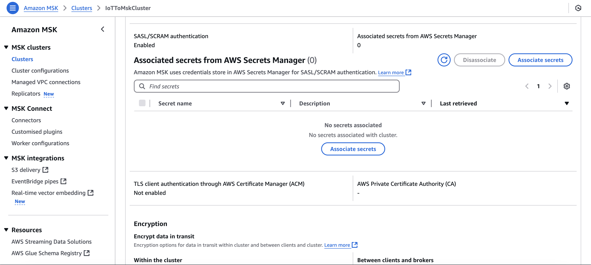
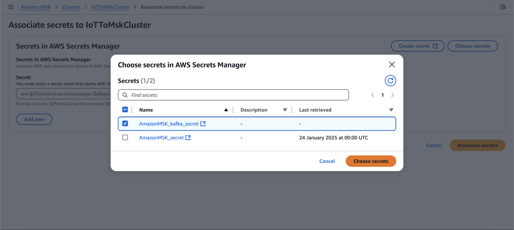
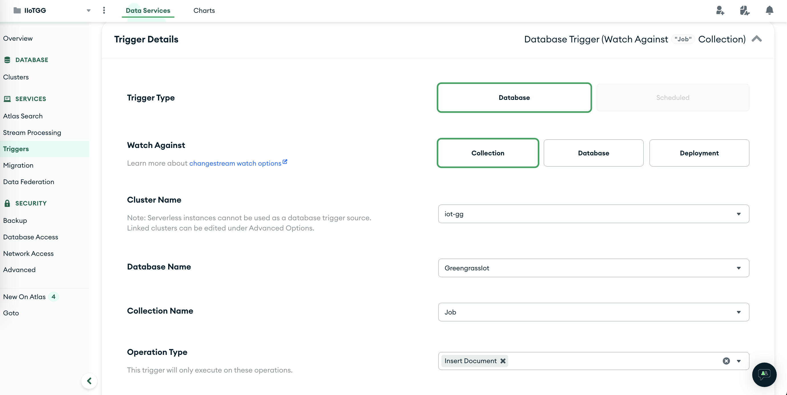
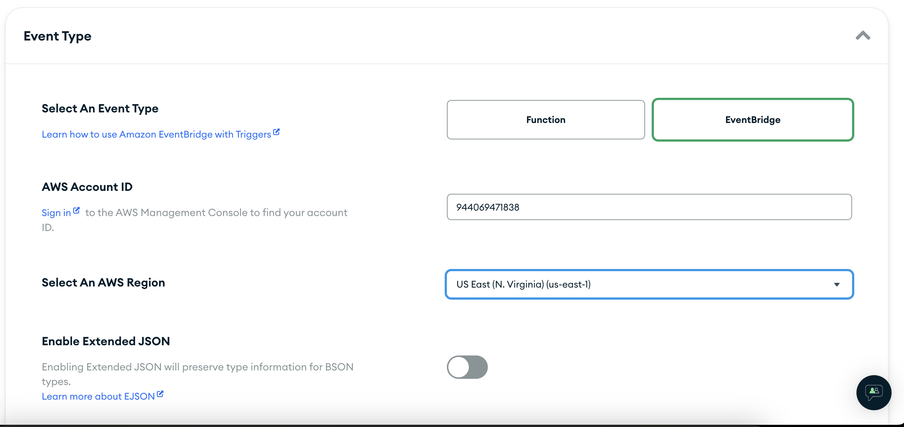
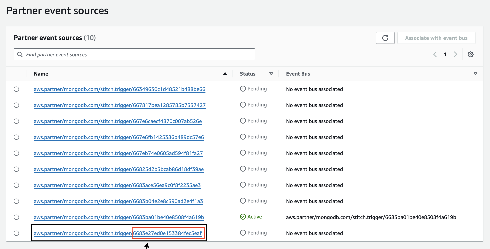
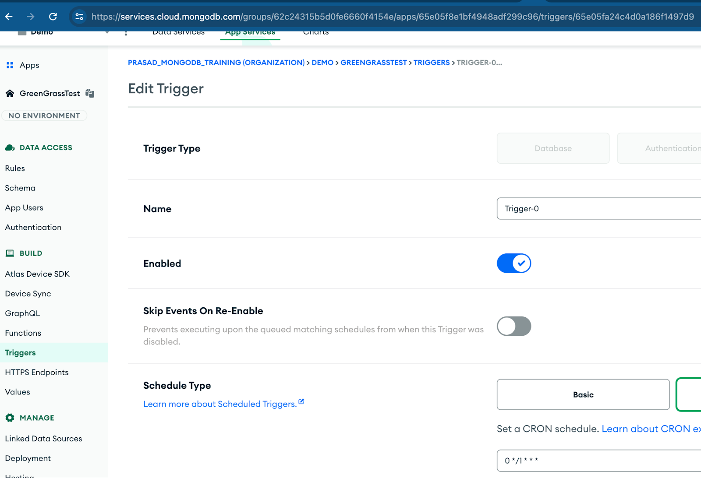

### Deploy Architecture

Before deploying, ensure you have the following details:

- **AWS Account ID**:
    - Run the `sts get-caller-identity` command:
        ```bash
        aws sts get-caller-identity
        ```
    - Locate your Account ID in the JSON response under the `Account` field:
        ```json
        {
            "UserId": "AIDxxxxxxxxxxxxxxxxx",
            "Account": "123456789012",
            "Arn": "arn:aws:iam::123456789012:user/your-username"
        }
        ```

- **AWS Region**: Use the region you configured with the CLI.

- **AWS Access & Secret Key**: Access key & secret key for your IAM user

- **MongoDb OrganizationId, Public and Private Key**: Access key & secret key for your IAM user

Once you have all the above-mentioned details, you can proceed to deploy the architecture

**CDK & Project Setup:**

- Go to the infra folder, install dependencies, build
    ```bash
    cd ./infra
    npm i
    npm run build
    ```


- Bootstrap your AWS account:
https://docs.aws.amazon.com/cdk/v2/guide/bootstrapping-env.html


    ```bash
    cdk bootstrap aws://ACCOUNT_NUMBER/REGION
    ```

-  Deploy the Infrastructure
    ```bash
    npm run deploy
    ```

- Provide all the inputs as prompted and follow the CLI prompts. 


### Kafka Secret Association Prompt

- When Prompted for Kafka Secret Association , You have to Go to AWS > MSK > CLusters > IOTToMSKCluster > Properties > Associate Secret


  

- Choose Secret > AmazonMsk_kafka_secret

 


### MongoDb Trigger Prompt

- When Prompted for Mongodb Trigger Id , You have to Go to Mongodb > Triggers > Create a new trigger
- Select/Create Database - GreengrassIot , Select/Create Collection - Job

  

- Select Event Bridge, and provide your AWS Account ID

  

- Then to extract Trigger Id for this trigger, Go to AWS > Event Bridge > Partner Event Sources > You will find a new entry for partner event bridge trigger

  

- You will be again prompted for  mdb-s3 scheduled trigger 

  

- Select Event Bridge for trigger type and follow the same process mentioned above for the first trigger

## Useful commands

* `npm run build`   compile typescript to js
* `npm run watch`   watch for changes and compile
* `npm run test`    perform the jest unit tests
* `npx cdk deploy`  deploy this stack to your default AWS account/region
* `npx cdk diff`    compare deployed stack with current state
* `npx cdk synth`   emits the synthesized CloudFormation template
